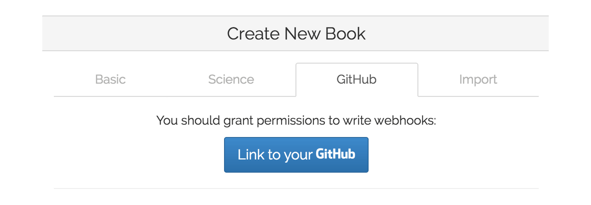
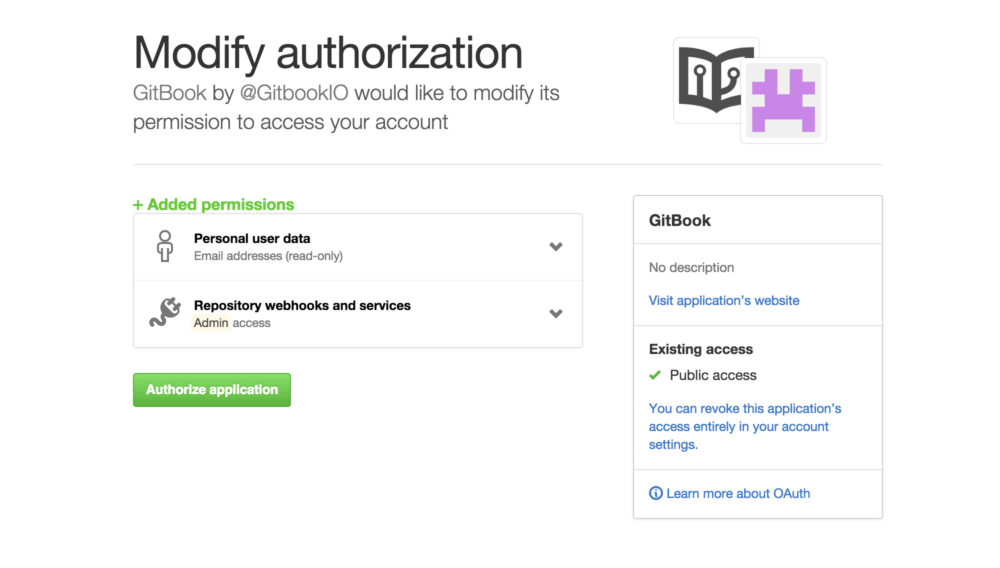
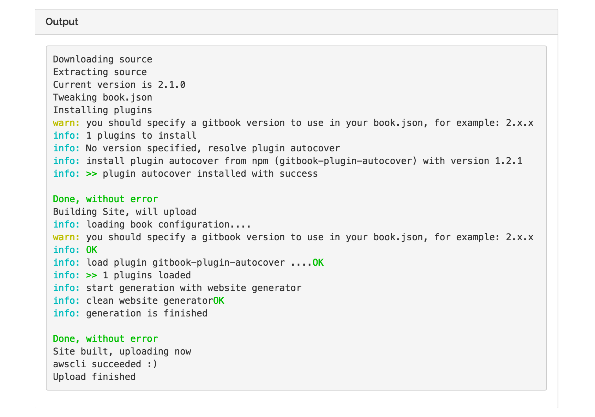
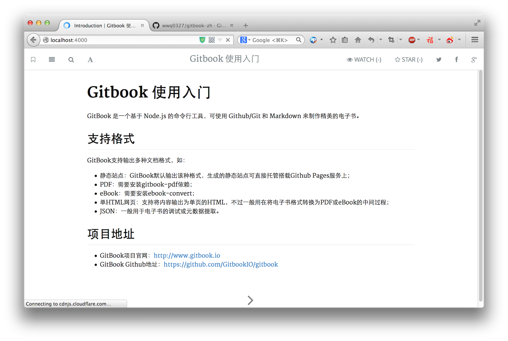

发布到gitbook
====

将本地预览没有问题的代码上传到GitHub之后，可以在GitBook中新建立图书，并从GitHub直接导入，并生成图书到GitBook

## 注册GitBook账号

- 在[GitBook](https://www.gitbook.com)首页注册新会员。
- 验证邮箱并补全详细信息。
- 关联GitHub账号授权，此处可以忽略，之后新建图书时如果未授权，会有授权提示。

## 从GitHub项目中导入

在页面右上角点击 Create a new book 按钮来新建图书

如果之前已经授权此处可以直接选择图书项目，未授权时点击按钮进行授权。

输入GitHub密码，进行授权，授权成功之后，回到新建图书页面，就可以看到关联账号下所有的项目。
选择对应项目之后，点击创建，会提示创建成功，可以点击链接，今日详情页面

可以选择View your book 选择在线预览，就是你现在看到的页面

## 从GitHub更新文章内容

图书在本地修改之后，git push 提交到git版本库中，然后再GitBook后台进行图书重新编译的操作，将最新内容更新到GitBook。

GitBook图书历史记录图书内容的每次修改，在下图中的 Book History 可以选择重新编译，生成最新版本的图书。

编译结果与第一次导入图书结果基本一致

PS: 实际操作结果显示，关联GitHub的图书，不需要手动进行编译，在推送代码之后，GitBook会自动检验更新，并生成最新页面。

