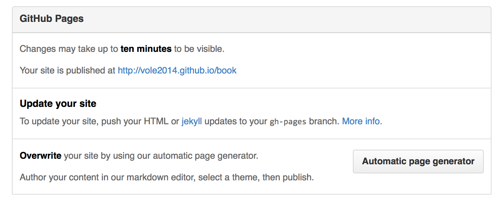

发布到github pages
====

将生编写好的格式为.md的文件通过Gitbook处理，然后再发布到Github Gages上去。我个人比较喜欢将源码，即`.md`文件与Github Pages静态文件存放在一个仓库中。`.md`文件为`master`分支，而hmtl文件为`gh-pages`分支。具体流程是这样的：

## 创建仓库与分支

- 登录到Github，创建一个新的仓库，名称我们就命令为`book`，这样我就就得到了一个`book`的空仓库。
- 克隆仓库到本地：`git clone git@github.com:USER_NAME/book.git`。
- 创建一个新分支：`git checkout -b gh-pages`，注意，分支名必须为`gh-pages`。
- 将分支push到仓库：`git push -u origin gh-pages`。
- 切换到主分支: `git checkout master`。

经过这一步处理，我们已经创建好`gh-pages`分支了，有了这个分支，Github会自动为你分配一个访问网址：

> http://USERNAME.github.io/book

你可以在项目页面右下`settings`中看到：

当然，由于我们内容还没有上传所以你点开链接，也只是一个404页面。

## 同步静态网站代码到分支

下面我们就可以将build好的静态网站代码同步到`gh-pages`分支中去了：

- 切换出master分支目录。我们需要将`gh-pages`分支内容存放到另一个目录中去。
- 克隆`gh-pages`分支：`git clone -b gh-pages git@github.com:USERNAME/book.git book-end`。这步我们只克隆了`gh-pages`分支，并存放在一个新的目录`book-end`里面。
- Copy静态多站代码到`book-end`目录中。
- Push到仓库。

然后，等十来分钟的样子，你就可以访问到你的在线图书了。而后，每次修改之后，都可以将生成的代码Copy到`book-end`目录，再Push一下就OK了。

当然，对于`gh-pages`存放问题，你也可以直接在master分支目录中直接`git clone` gh-pages分支，假如名称为`book-end`，然后修改一下`.gitignore`文件，将`book-end/`添加进去，这样主分支就不会理会`book-end`内容的修改了。

笔者曾试过直接使用`gitbook build --output=/PATH/book-end`这个方式输出到`gh-pages`分支目录中，但发现gitbook在build的时候，相当于删除存在的这个目录，然后再新建目录，再写入内容，原来的git信息会完全删除掉，显示这不是我们想要看到的，所以只能Copy才行。
